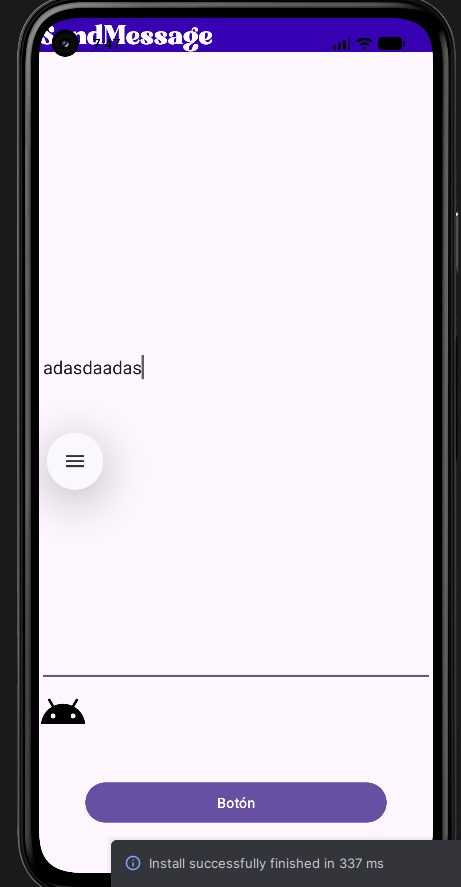
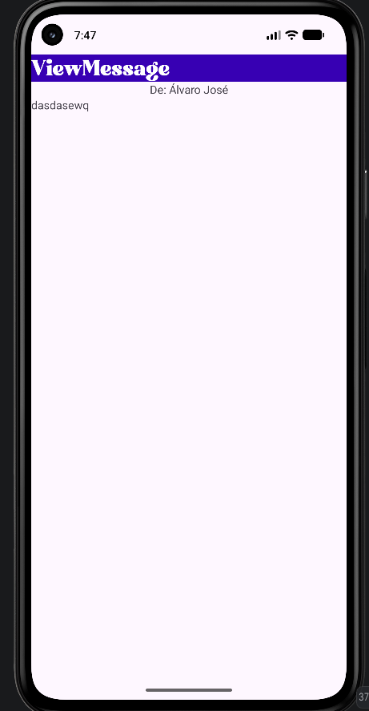
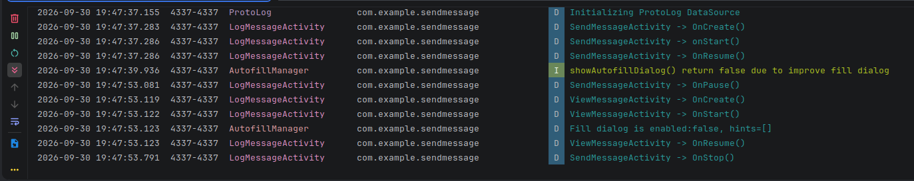

# SendMessage - Aplicación Android

**SendMessage** es una aplicación nativa para Android desarrollada en **Kotlin** que ilustra la comunicación inter-componentes en Android mediante el paso de datos entre diferentes actividades (`Activity`) utilizando `Intent` y `Bundle`.

---

## 📸 Capturas de Pantalla (Ejecución en Emulador) [OBLIGATORIO]

A continuación se presentan las capturas de pantalla que muestran la aplicación ejecutándose en un emulador de Android:

| Pantalla Principal (`SendMessageActivity`) | Pantalla de Recepción (`ViewMessageActivity`) |
| :-----------------------------------------: | :-------------------------------------------: |
|  |  |

---

## 🏗️ Estructura del Proyecto y Decisiones de Diseño

### 📂 Estructura del Código

El proyecto sigue la arquitectura recomendada para aplicaciones nativas Android organizadas por paquetes:

```
SendMessage/
├── app/
│   ├── src/

│   │   └── main/
│   │       ├── java/com/example/sendmessage/
│   │       │   ├── SendMessageApplication.kt  # Clase Application personalizada
│   │       │   ├── SendMessageActivity.kt     # Actividad principal para redacción de mensajes
│   │       │   ├── ViewMessageActivity.kt     # Actividad para mostrar el mensaje recibido
│   │       │   └── model/                     # Modelos de datos (Message.kt, Person.kt)
│   │       ├── res/
│   │       │   ├── font/                      # Fuentes personalizadas (bright_sunlist.otf)
│   │       │   ├── layout/                    # Diseños de interfaz XML (activity_send_message.xml, activity_view_message.xml)
│   │       │   ├── values/                    # Recursos de texto (strings.xml), colores, dimensiones y temas
│   │       │   └── navigation/                # Grafos de navegación XML
│   │       └── AndroidManifest.xml            # Declaración de componentes e intenciones
├── docs/
│   └── images/                                # Capturas de pantalla y evidencias
├── README.md
└── CHANGELOG.md
```

### 💡 Decisiones de Diseño

1. **Arquitectura basada en Componentes Android (`Activity`)**:
   - `SendMessageActivity`: Actividad que actúa como punto de entrada (`LAUNCHER`). Contiene un campo de texto `EditText` (`etMessageText`) y un botón `Button` (`btSend`).
   - `ViewMessageActivity`: Actividad secundaria encargada de recibir el mensaje extraído del `Intent` y mostrarlo mediante los `TextView` (`tvSender` y `tvView`).

2. **Mecanismo de Paso de Datos (`Intent` + `Bundle`)**:
   - Se utiliza una clave explícita (`KEY_MESSAGE`) dentro de un `Bundle` encapsulado en un `Intent` explícito para enviar el objeto serializable `Message` entre la actividad emisora y la receptora de forma segura y estructurada.

3. **Diseño de Interfaz de Usuario y Recursos Extraídos**:
   - Se emplean contenedores de diseño `LinearLayout` con orientación vertical para una estructura clara y adaptable.
   - Todos los textos mostrados en la UI están centralizados en `res/values/strings.xml` para facilitar la internacionalización y mantenibilidad.
   - Tipografía personalizada cargada dinámicamente mediante `res/font/bright_sunlist.otf`.
   - Compatibilidad con configuraciones de pantalla landscape (`res/values-land/`) y diseño adaptativo mediante dimensiones centralizadas en `dimens.xml`.

---

## 🐞 Proceso de Depuración y Evidencias de Logcat [OBLIGATORIO]

### Descripción del Proceso de Depuración
El proceso de depuración de la aplicación se llevó a cabo utilizando **Android Studio Logcat** y puntos de interrupción (*breakpoints*) estratégicos:
1. **Traza de Ejecución**: Monitorización de eventos del ciclo de vida de las actividades (`onCreate`, `onStart`, `onResume`, `onPause`, `onStop`, `onDestroy`) mediante filtrado por la etiqueta `LogMessageActivity` (`com.example.sendmessage`).
2. **Verificación de Datos del Intent**: Comprobación en tiempo de ejecución del contenido adjunto en el `Bundle` previa al lanzamiento de `ViewMessageActivity`.
3. **Manejo de Excepciones**: Verificación de nulos al recuperar elementos con `findViewById` y lectura de extras mediante `IntentCompat`.

### Evidencias de Logcat


---

## 📂 Conexión al Directorio `/data/data/` de la Aplicación

El directorio privado de la aplicación se encuentra en el almacenamiento interno en la ruta:
`/data/data/com.example.sendmessage/`

Esta carpeta contiene los archivos privados de la aplicación (bases de datos SQLite/Room, `SharedPreferences`, caché y archivos de configuración).

---

## 🔗 Enlaces a la Documentación Oficial de Android Developer

- 📘 [Guía de Intents y Filtros de Intent](https://developer.android.com/guide/components/intents-filters?hl=es-419)
- 📗 [Entender el Ciclo de Vida de las Actividades](https://developer.android.com/guide/components/activities/activity-lifecycle?hl=es-419)
- 📙 [Paso de Datos mediante Bundle y Extras](https://developer.android.com/reference/android/os/Bundle)
- 📕 [Declaración de Diseños en XML (Layouts)](https://developer.android.com/guide/topics/ui/declaring-layout?hl=es-419)
- 📓 [Depuración de Aplicaciones con Logcat](https://developer.android.com/studio/debug/am-logcat?hl=es-419)
